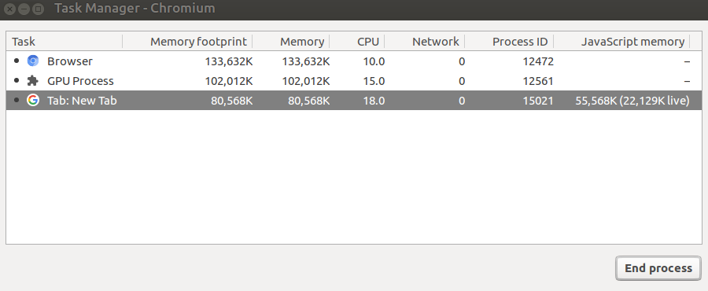
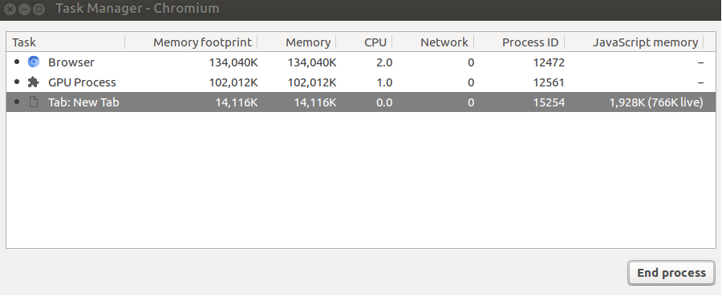

Chromium Empty New Tab
======================
A **really** empty new tab.

Why?
----

Install
------
Clone this repository, in the extensions tab check `developer mode`, then `Load unpacked extension` and select this the repository folder.

The new tab will have a bar with 'customize chromium' on the bottom right, click that and disable the bar from displaying there.

License
------
MIT License, see LICENSE.md.

Copyright (c) 2018 Ivor Wanders
